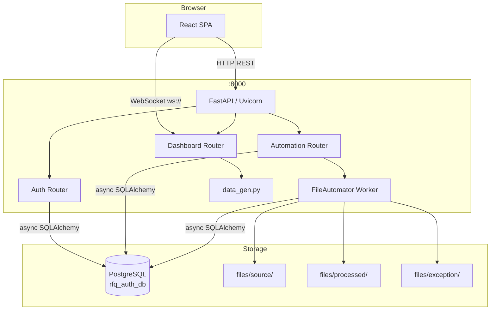
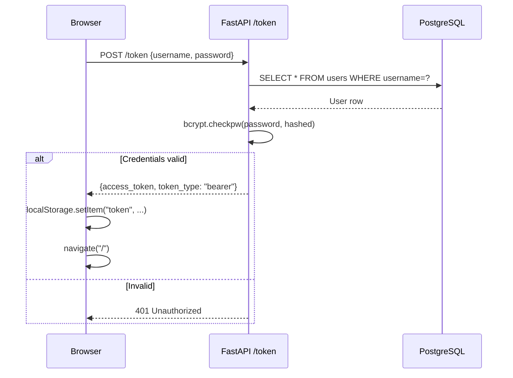
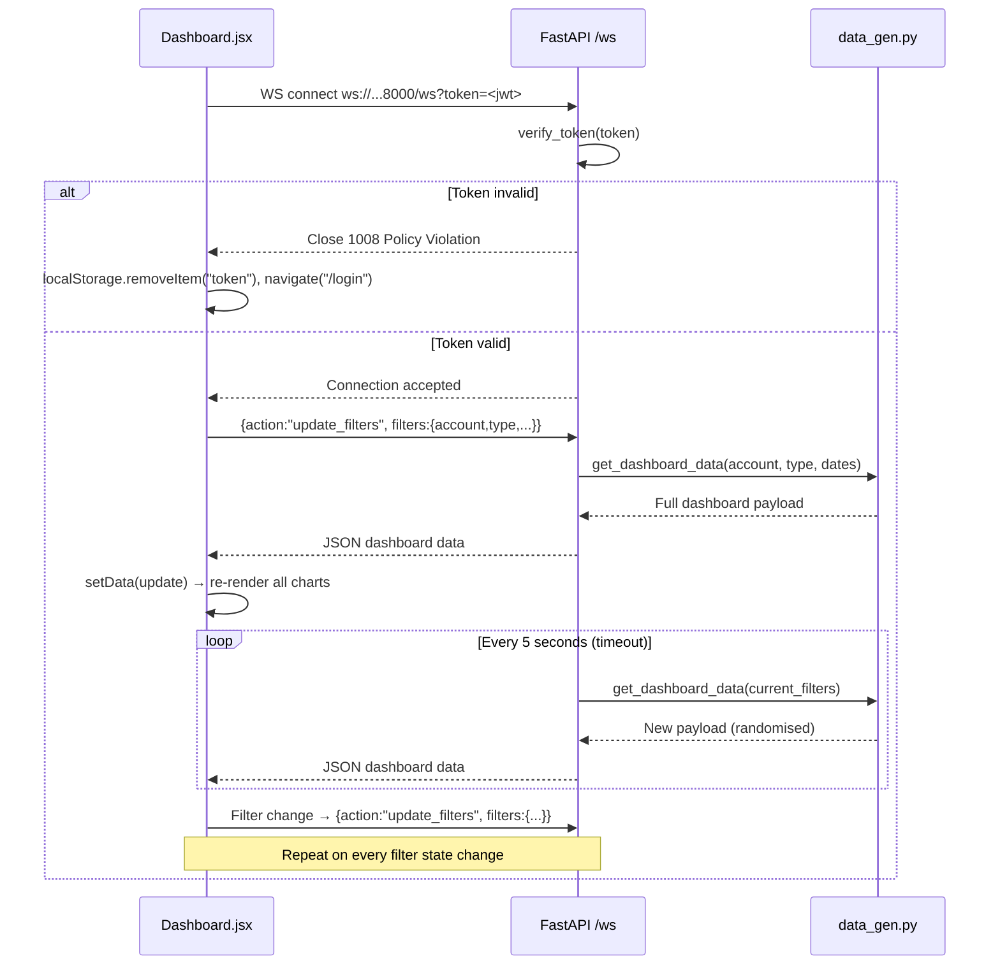
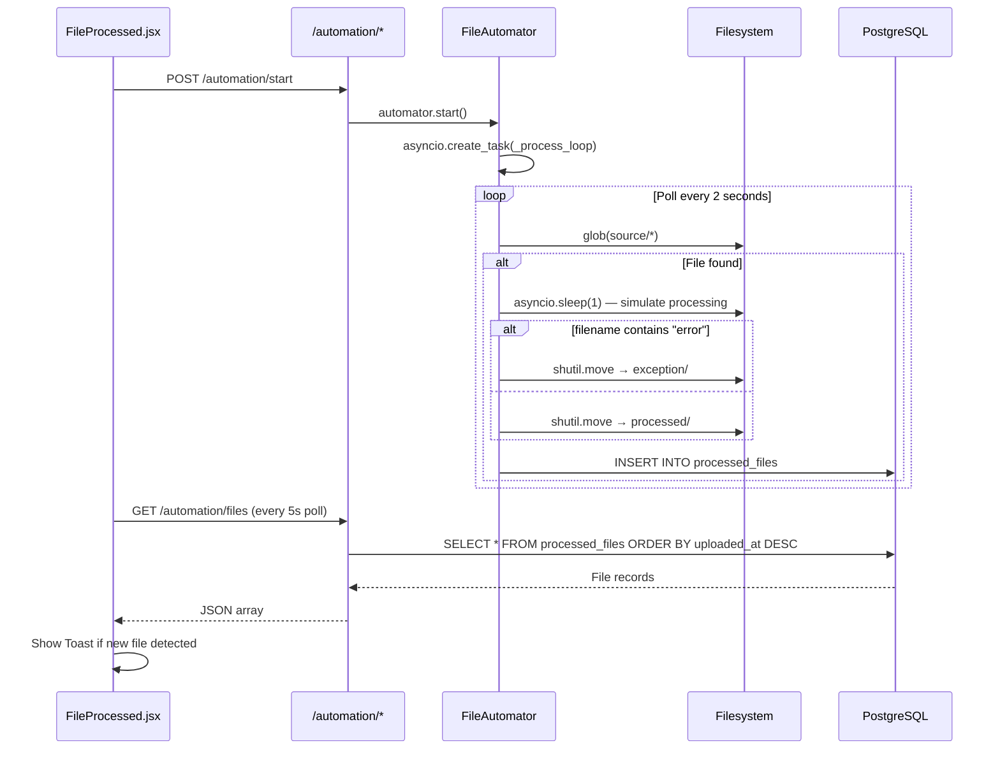
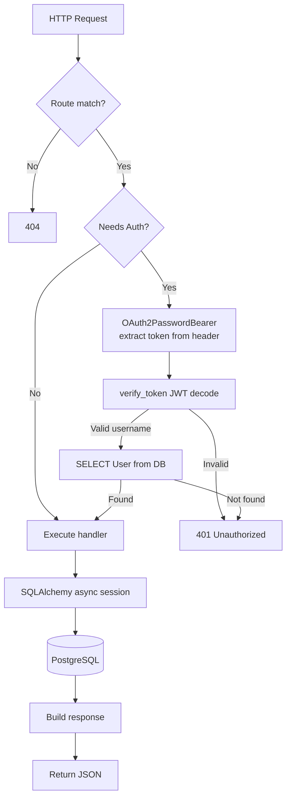
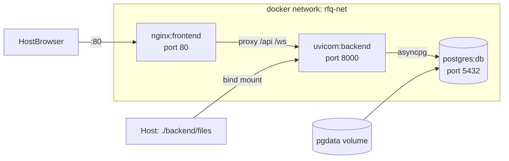

# PROJECT_DOCUMENTATION.md

> RFQ Dashboard — Complete Technical Reference  
> Generated: 2026-05-09

---

## Table of Contents

1. [Project Overview](#1-project-overview)
2. [Complete Folder Structure](#2-complete-folder-structure)
3. [Service Architecture](#3-service-architecture)
4. [Complete Request Flow](#4-complete-request-flow)
5. [Database Documentation](#5-database-documentation)
6. [API Documentation](#6-api-documentation)
7. [Environment Variables](#7-environment-variables)
8. [Dependency Documentation](#8-dependency-documentation)
9. [Startup Flow](#9-startup-flow)
10. [Deployment Architecture](#10-deployment-architecture)
11. [Security Review](#11-security-review)
12. [Performance Review](#12-performance-review)
13. [Improvements & Recommendations](#13-improvements--recommendations)

---

## 1. Project Overview

### What It Does

The RFQ Dashboard is a full-stack business intelligence web application that allows procurement teams to monitor and analyze **Request For Quotation (RFQ)** activity across multiple customer accounts (SEC, Aramco, Sabic, etc.). It provides:

- A real-time analytics dashboard driven by WebSocket push
- KPI cards (total RFQs, quote rates, win ratios, PO values)
- Six interactive chart types (RFQ flow, bid/quote ratio, participation, quote value, hit ratio, waterfall funnel)
- A filterable bidding table and agreement table
- Supplier & spend analysis
- Excel export of dashboard data
- A file processing management page that monitors an automation service which watches a folder for dropped files
- JWT-based multi-user authentication with registration and password change

### Business Purpose

The system is an internal dashboard for an industrial procurement company (Antigravity / Falio brand) to track quoting pipeline health across major Saudi accounts. Dashboard data is currently simulated — the next development phase would wire it to a real ERP/CRM data source.

### High-Level Architecture

```
Browser
  │
  ├── REST (HTTP)  ──► FastAPI Backend ──► PostgreSQL
  │
  └── WebSocket   ──► FastAPI Backend (data generation service)
                        └── File Automation Worker (in-process)
                              └── backend/files/{source,processed,exception}/
```

Three logical layers:
| Layer | Technology |
|---|---|
| Frontend SPA | React 19 + Vite + Tailwind CSS |
| Backend API | FastAPI (Python 3.11+) + asyncpg |
| Database | PostgreSQL (users + processed file records) |

---

## 2. Complete Folder Structure

```
rfq-dashboard/
├── backend/                        # Python backend root
│   ├── app/                        # Production application package
│   │   ├── api/
│   │   │   └── endpoints/
│   │   │       ├── auth.py         # /token, /users, /users/me/* routes
│   │   │       ├── dashboard.py    # /accounts + /ws WebSocket endpoint
│   │   │       └── automation.py   # /automation/* routes
│   │   ├── core/
│   │   │   ├── config.py           # Pydantic Settings (reads .env)
│   │   │   ├── database.py         # Async SQLAlchemy engine + session factory
│   │   │   ├── models.py           # SQLAlchemy declarative Base
│   │   │   └── security.py         # JWT + bcrypt helpers  ⚠ hardcoded SECRET_KEY
│   │   ├── models/
│   │   │   ├── user.py             # User ORM model
│   │   │   └── file.py             # ProcessedFile ORM model
│   │   ├── services/
│   │   │   ├── data_gen.py         # Dashboard data simulation engine
│   │   │   └── automation.py       # FileAutomator background worker
│   │   └── main.py                 # FastAPI app factory + router registration
│   ├── alembic/                    # DB migration scripts
│   │   ├── env.py                  # Migration runner (async-aware)
│   │   └── versions/               # Auto-generated migration files
│   ├── files/                      # File automation working directories
│   │   ├── source/                 # Drop files here for automation to pick up
│   │   ├── processed/              # Successfully processed files land here
│   │   └── exception/              # Files containing "error" in filename land here
│   ├── main.py                     # ⚠ DEAD CODE — standalone prototype (no auth/DB)
│   ├── init_db.py                  # One-shot script: create_all tables
│   ├── create_superuser.py         # One-shot script: create admin user
│   ├── create_user_murshid.py      # ⚠ Dev artifact — user-specific seeding script
│   ├── test_ws.py                  # Manual WebSocket smoke test
│   ├── test_filters.py             # Manual filter validation test
│   ├── requirements.txt            # Python dependencies
│   └── alembic.ini                 # Alembic configuration
│
├── src/                            # React application source
│   ├── pages/
│   │   ├── Login.jsx               # Auth page (login / register / change-password)
│   │   ├── Dashboard.jsx           # Main analytics page (WebSocket consumer)
│   │   └── FileProcessed.jsx       # File processing management page
│   ├── components/
│   │   ├── Charts/                 # Recharts wrappers (one file per chart type)
│   │   ├── Dashboard/
│   │   │   ├── FilterBar.jsx       # Account / type / date / more-filters bar
│   │   │   ├── KPIGrid.jsx         # KPI card grid
│   │   │   ├── BiddingTable.jsx    # Filterable bidding data table
│   │   │   ├── AgreementTable.jsx  # Agreement-mode table
│   │   │   ├── SupplierKPIs.jsx    # Supplier performance cards
│   │   │   ├── RFQDetailsModal.jsx # Detail modal (currently unused)
│   │   │   └── UserManagementModal.jsx  # User admin modal (currently unused)
│   │   ├── Layout/
│   │   │   ├── Header.jsx          # Top navigation bar
│   │   │   ├── Sidebar.jsx         # Collapsible left navigation
│   │   │   └── UserMenu.jsx        # Avatar + logout dropdown
│   │   ├── UI/
│   │   │   └── Toast.jsx           # Toast notification component
│   │   └── ProtectedRoute.jsx      # Client-side auth guard
│   ├── App.jsx                     # Router configuration
│   ├── main.jsx                    # React DOM entry point
│   └── index.css                   # Global CSS + Tailwind directives
│
├── public/                         # Static assets (logos, favicons)
├── dist/                           # Vite production build output (gitignored typically)
├── index.html                      # Vite HTML shell
├── vite.config.js                  # Vite + React plugin config
├── tailwind.config.js              # Tailwind configuration
├── postcss.config.js               # PostCSS (autoprefixer)
├── eslint.config.js                # ESLint flat config
├── package.json                    # Frontend dependencies + scripts
├── CLAUDE.md                       # AI assistant context file
└── PROJECT_DOCUMENTATION.md       # This file
```

---

## 3. Service Architecture

### 3.1 Frontend (React SPA)

| Attribute | Value |
|---|---|
| Entry point | `src/main.jsx` |
| Router | React Router v7 (`BrowserRouter`) |
| State management | Local `useState` in page components |
| Styling | Tailwind CSS v3 + tailwind-merge + clsx |
| Build tool | Vite 7 |
| Dev port | `5173` |

**Route table:**

| Path | Component | Auth Required |
|---|---|---|
| `/login` | `Login.jsx` | No |
| `/` | `FileProcessed.jsx` | Yes |
| `/dashboard` | `Dashboard.jsx` | Yes |

`ProtectedRoute` performs a client-side token presence check only. The actual JWT is validated server-side on every authenticated request.

### 3.2 Backend API (FastAPI)

| Attribute | Value |
|---|---|
| Entry point | `backend/app/main.py` (ASGI app object) |
| Runtime | Uvicorn (ASGI server) |
| Default port | `8000` |
| ORM | SQLAlchemy 2.x async (`asyncpg` driver) |
| Auth | OAuth2 password flow + JWT (HS256, 30 min TTL) |

**Router registration:**

```
app
├── auth.router        (no prefix)   → /token, /users, /users/me, /users/exists
├── dashboard.router   (no prefix)   → /accounts, /ws
└── automation.router  /automation   → /automation/start|stop|status|files
```

### 3.3 File Automation Worker

Runs **inside the backend process** as an asyncio background task. Not a separate service.

| Attribute | Value |
|---|---|
| Class | `backend/app/services/automation.py::FileAutomator` |
| Poll interval | 2 seconds |
| Input directory | `backend/files/source/` |
| Success output | `backend/files/processed/` |
| Error output | `backend/files/exception/` |
| Error detection | Filename contains substring `"error"` |
| DB write | Inserts a `ProcessedFile` row on every file processed |

Started/stopped via `POST /automation/start` and `POST /automation/stop`.

### 3.4 PostgreSQL Database

Single database (`rfq_auth_db`) with two tables managed by Alembic migrations.

### 3.5 Dead / Development Artifacts

| File | Status | Notes |
|---|---|---|
| `backend/main.py` | Dead code | Standalone prototype with no auth. Has supplier/price filters but app version does not. |
| `backend/create_user_murshid.py` | Dev artifact | Hard-coded user seeding script |
| `src/components/Dashboard/RFQDetailsModal.jsx` | Unused | Modal exists but is never opened |
| `src/components/Dashboard/UserManagementModal.jsx` | Unused | Modal exists but is never opened |

---

## 4. Complete Request Flow

### 4.1 System Architecture Diagram



### 4.2 Authentication Flow



### 4.3 WebSocket Dashboard Flow



### 4.4 File Automation Flow



### 4.5 Request Lifecycle (REST)



---

## 5. Database Documentation

### 5.1 Tables

#### `users`

| Column | Type | Constraints | Notes |
|---|---|---|---|
| `id` | INTEGER | PK, indexed | Auto-increment |
| `username` | VARCHAR | UNIQUE, indexed, NOT NULL | Login identifier |
| `hashed_password` | VARCHAR | NOT NULL | bcrypt hash |
| `is_active` | BOOLEAN | DEFAULT true | Account status flag |
| `is_superuser` | BOOLEAN | DEFAULT false | Admin flag (not enforced yet) |

#### `processed_files`

| Column | Type | Constraints | Notes |
|---|---|---|---|
| `id` | INTEGER | PK, indexed | Auto-increment |
| `filename` | VARCHAR | indexed | Original filename before renaming |
| `uploaded_at` | TIMESTAMP WITH TZ | server_default=now() | Set by DB on INSERT |
| `completed_at` | TIMESTAMP WITH TZ | nullable | Set explicitly by automation service |
| `processed_time` | VARCHAR | nullable | Duration string e.g. `"00:00:01"` |
| `status` | VARCHAR | DEFAULT "Pending" | `Complete` \| `Exception` \| `Processing` |
| `validation` | BOOLEAN | DEFAULT false | True when status is Complete |

### 5.2 Relationships

No foreign key relationships exist between tables. The two tables are independent.

### 5.3 Migrations

Alembic is configured with an async-aware `env.py`. The `sqlalchemy.url` in `alembic.ini` is a placeholder — the actual URL is always injected from `app.core.config.settings.DATABASE_URL` at migration runtime.

Run from the `backend/` directory:
```bash
alembic upgrade head          # apply all pending migrations
alembic downgrade -1          # roll back one migration
alembic revision --autogenerate -m "add column x"
```

Alternative (development only, bypasses Alembic versioning):
```bash
python init_db.py             # runs Base.metadata.create_all()
```

### 5.4 Connection Handling

- Engine: `create_async_engine` with `asyncpg` driver
- Session factory: `AsyncSessionLocal` (expire_on_commit=False)
- Dependency injection: `get_db()` yields an `AsyncSession` per request, auto-closed via `async with`
- Connection pool: SQLAlchemy default async pool (5 connections)

---

## 6. API Documentation

All endpoints are served from `http://localhost:8000`.

### Authentication

#### `POST /token`
Login and obtain JWT.
- **Auth:** None
- **Content-Type:** `application/x-www-form-urlencoded`
- **Body:** `username=<str>&password=<str>`
- **Response 200:**
  ```json
  { "access_token": "<jwt>", "token_type": "bearer" }
  ```
- **Response 401:** Invalid credentials

#### `POST /users`
Register a new user.
- **Auth:** None
- **Body:** `{ "username": "string", "password": "string" }`
- **Response 201:** `{ "message": "User created successfully" }`
- **Response 400:** Username already registered

#### `GET /users/exists?username=<str>`
Check if username is taken.
- **Auth:** None
- **Response 200:** `{ "exists": true | false }`

#### `GET /users/me`
Get current user profile.
- **Auth:** Bearer JWT
- **Response 200:** `{ "username": "string", "role": "Admin" }`

#### `PUT /users/me/password`
Change own password.
- **Auth:** Bearer JWT
- **Body:** `{ "old_password": "string", "new_password": "string" }`
- **Response 200:** `{ "message": "Password updated successfully" }`
- **Response 400:** Incorrect old password

---

### Dashboard

#### `GET /accounts`
List available account names.
- **Auth:** None  ⚠ Should require auth
- **Response 200:** `["SEC", "Aramco", "Sabic", "Hadeed", "Maaden", "Marafic"]`

#### `WebSocket /ws?token=<jwt>`
Live dashboard data stream.
- **Auth:** JWT in query param (closes with 1008 if invalid)
- **Client → Server messages:**
  ```json
  {
    "action": "update_filters",
    "filters": {
      "account": "SEC",
      "type": "Direct",
      "startDate": "2023-01-01",
      "endDate": "2023-12-31"
    }
  }
  ```
- **Server → Client messages:** Full dashboard payload (see below)
- **Push cadence:** Immediately on filter update; periodic every ~5 seconds

**Dashboard payload structure:**
```json
{
  "timestamp": "ISO8601",
  "account": "SEC",
  "kpis": {
    "totalRFQ": 4400,
    "rfqQuoted": 1980,
    "bidRatio": 45.0,
    "winVolumeRatio": 44.3,
    "totalLI": 28600,
    "liQuoted": 8690,
    "liBidRatio": 30.4,
    "winValueRatio": 25.0,
    "poValue": "41.8M"
  },
  "agreementKPIs": { ... },
  "charts": {
    "rfqFlow": [ { "month": "Jan", "rfqReceived": 330, "quoted": 148, "lineItems": 1650 } ],
    "bidQuoteRatio": [ { "month": "Jan", "liQuoted": 592, "quotePercentage": 38 } ],
    "participation": [ { "month": "Jan", "totalQuoted": 148, "participationRate": 42 } ],
    "quoteValue": [ { "month": "Jan", "value": 7.4 } ],
    "hitRatio": [ { "month": "Jan", "totalQuoteValue": 8.9, "totalPOValue": 3.0, "awardedPercentage": 22 } ],
    "waterfall": [ { "name": "Total RFQ", "value": 31928, "fill": "#2dd4bf" }, ... ],
    "biddingTable": [ { "id": "RFQ-20230000", "date": "2023-6-15", "status": "Won", "amount": "72345.12", "account": "SEC" } ],
    "agreementTable": [ ... ]
  },
  "supplierStats": {
    "deliveryTime": 92,
    "defectRate": 3,
    "responseRate": 97,
    "warrantyResponse": 98
  },
  "spendAnalysis": {
    "manufacturer": [ { "name": "Siemens", "value": 480 } ],
    "region": [ { "name": "Dammam", "value": 600 } ]
  }
}
```

---

### Automation

#### `POST /automation/start`
Start the file automation worker.
- **Auth:** None  ⚠ Should require auth
- **Response 200:** `{ "status": "started", "running": true }`

#### `POST /automation/stop`
Stop the file automation worker.
- **Auth:** None  ⚠ Should require auth
- **Response 200:** `{ "status": "stopped", "running": false }`

#### `GET /automation/status`
Check automation worker state.
- **Auth:** None  ⚠ Should require auth
- **Response 200:** `{ "running": true | false }`

#### `GET /automation/files`
List all processed file records.
- **Auth:** None  ⚠ Should require auth
- **Response 200:** Array of ProcessedFile objects
  ```json
  [
    {
      "id": 1,
      "filename": "rfq_batch_001.xlsx",
      "uploaded_at": "2026-05-09T10:00:00Z",
      "completed_at": "2026-05-09T10:00:01Z",
      "processed_time": "00:00:01",
      "status": "Complete",
      "validation": true
    }
  ]
  ```

---

## 7. Environment Variables

All backend variables are read by `backend/app/core/config.py` using `pydantic-settings`, which loads from a `.env` file in the working directory.

| Variable | Default | Description |
|---|---|---|
| `DATABASE_URL` | `postgresql+asyncpg://murshi.@localhost/rfq_auth_db` | Full async PostgreSQL DSN. Must use `+asyncpg` driver prefix. |
| `SECRET_KEY` | `supersecretkeywow` | **⚠ MUST be changed in production.** Used for JWT signing. Note: `security.py` currently has its own hardcoded copy — see Security Review. |
| `ALGORITHM` | `HS256` | JWT signing algorithm |
| `ACCESS_TOKEN_EXPIRE_MINUTES` | `30` | JWT TTL in minutes |
| `PROJECT_NAME` | `RFQ Dashboard` | Application name (used in OpenAPI docs title) |

**Frontend (Vite):** No `.env` file exists today. All API URLs are hardcoded as `http://localhost:8000` throughout the source. To make the app configurable:

| Variable | Example | Description |
|---|---|---|
| `VITE_API_BASE_URL` | `http://localhost:8000` | Backend REST base URL |
| `VITE_WS_BASE_URL` | `ws://localhost:8000` | Backend WebSocket base URL |

---

## 8. Dependency Documentation

### Backend (`requirements.txt`)

| Package | Purpose |
|---|---|
| `fastapi` | ASGI web framework; provides routing, dependency injection, OpenAPI generation |
| `uvicorn` | ASGI server that runs the FastAPI app |
| `websockets` | WebSocket protocol support (used by uvicorn/FastAPI) |
| `python-jose[cryptography]` | JWT encoding/decoding (HS256) |
| `bcrypt` | Password hashing — industry-standard adaptive hash |
| `python-multipart` | Required for FastAPI `Form` data parsing (OAuth2 login form) |
| `sqlalchemy` | ORM + query builder; async session support |
| `asyncpg` | High-performance async PostgreSQL driver used by SQLAlchemy |
| `alembic` | Database schema migration tool |
| `greenlet` | Required by SQLAlchemy async mode |
| `pydantic-settings` | Typed settings management with `.env` file support |

### Frontend (`package.json`)

| Package | Purpose |
|---|---|
| `react` / `react-dom` | UI framework v19 |
| `react-router-dom` v7 | Client-side routing |
| `recharts` | Composable chart library built on D3/SVG |
| `framer-motion` | Animation library used in Login page transitions |
| `xlsx` | Parse/write Excel files; used for dashboard export |
| `lucide-react` | Icon library |
| `clsx` + `tailwind-merge` | Utility for conditional Tailwind class composition |
| `tailwindcss` | Utility-first CSS framework |
| `vite` | Frontend build tool + HMR dev server |
| `@vitejs/plugin-react` | Vite plugin for React JSX + Fast Refresh |

---

## 9. Startup Flow

### Backend Startup

1. Uvicorn receives the ASGI app target `app.main:app`
2. FastAPI instantiates the `app` object in `backend/app/main.py`
3. CORS middleware is registered (currently allows all origins)
4. Three routers are mounted (auth, dashboard, automation)
5. `FileAutomator.__init__()` runs at import time → creates `files/source/`, `files/processed/`, `files/exception/` if missing
6. `create_async_engine()` is called in `database.py` → connection pool is created but not yet used
7. App is ready. No automatic schema migration — must run `alembic upgrade head` separately

### Frontend Startup (Development)

1. `npm run dev` starts the Vite dev server
2. Vite processes `index.html` → injects `src/main.jsx` as module
3. `main.jsx` mounts `<App />` into `#root`
4. `App.jsx` renders `<BrowserRouter>` with three routes
5. `ProtectedRoute` checks `localStorage` for `token`
6. If token present → render page; if absent → redirect to `/login`

### Frontend Startup (Production Build)

1. `npm run build` → Vite bundles and tree-shakes to `dist/`
2. `dist/` is served by any static file server (nginx, etc.)

---

## 10. Deployment Architecture

### Docker Compose Overview



- **`db`**: PostgreSQL 16, data persisted in a named Docker volume
- **`backend`**: FastAPI + Uvicorn, bind-mounts `./backend/files` so automation files persist on the host
- **`frontend`**: Nginx — serves the Vite build and reverse-proxies `/api/` and `/ws` to the backend container

### Important Pre-Deploy Step

The frontend currently hardcodes `http://localhost:8000`. Before building for Docker, replace all occurrences with the build-time env var pattern:

```js
const API_BASE = import.meta.env.VITE_API_BASE_URL ?? 'http://localhost:8000';
const WS_BASE  = import.meta.env.VITE_WS_BASE_URL  ?? 'ws://localhost:8000';
```

The provided `Dockerfile.frontend` passes `VITE_API_BASE_URL` as a build arg so the compiled JS has the correct URL baked in.

### Scaling Strategy

| Concern | Current | Production Path |
|---|---|---|
| Backend | Single process | Multiple Uvicorn workers (`--workers 4`) or horizontal scaling behind load balancer |
| Database | Single PostgreSQL | Read replicas + connection pooler (PgBouncer) |
| WebSocket | Per-process state | If horizontally scaled, WebSocket sessions need sticky routing or shared state (Redis pub/sub) |
| File automation | In-process task | Extract to separate container/worker with shared NFS/S3 volume |
| Frontend | Static files | Already stateless; CDN-friendly |

---

## 11. Security Review

### Critical Issues

| # | Severity | Finding |
|---|---|---|
| 1 | **CRITICAL** | `security.py` has its own hardcoded `SECRET_KEY = "supersecretkeywow"` that is **not read from `config.py`**. Changing the env var has no effect on JWT signing. The constant in `security.py` must be replaced with `from .config import settings; SECRET_KEY = settings.SECRET_KEY`. |
| 2 | **HIGH** | CORS is set to `allow_origins=["*"]`. This allows any domain to make credentialed requests to the API. Should be locked to the specific frontend origin in production. |
| 3 | **HIGH** | JWT token stored in `localStorage` is accessible to any JavaScript on the page and is vulnerable to XSS attacks. `httpOnly` cookies are the more secure alternative. |
| 4 | **HIGH** | `/accounts`, `/automation/*` endpoints have no authentication requirement. Any unauthenticated user can start/stop the automation worker or list processed files. |
| 5 | **MEDIUM** | No rate limiting on `/token`. Login endpoint is open to brute-force attacks. |
| 6 | **MEDIUM** | No HTTPS enforced. JWT tokens and credentials will be transmitted in plaintext without TLS termination. |
| 7 | **MEDIUM** | `SECRET_KEY` default value (`"supersecretkeywow"`) is a weak, publicly known string. Any token signed with this key is forgeable if the key is not changed. |
| 8 | **LOW** | User role is hardcoded as `"Admin"` in `/users/me` response regardless of the `is_superuser` DB column. |
| 9 | **LOW** | The `ProtectedRoute` component relies solely on token presence in `localStorage`. An expired or tampered token will pass the client guard until the first API call or WebSocket connect. |

---

## 12. Performance Review

### Identified Bottlenecks

| Area | Issue | Recommendation |
|---|---|---|
| **Dashboard data** | Every WebSocket message re-generates the entire dataset with `random()` calls. No caching. | When real data is wired, cache the query result and only push on cache invalidation, not every 5 seconds. |
| **WebSocket periodic push** | Server pushes to all clients every 5 seconds unconditionally even if data hasn't changed. | Implement change detection; only push when the underlying data changes. |
| **Bidding table** | 50 rows are generated per WebSocket push. With real data this should be paginated server-side. | Add pagination params to the WebSocket filter message. |
| **DB queries** | `get_files` fetches all rows with no pagination (`SELECT * FROM processed_files`). Will degrade as table grows. | Add `LIMIT` / `OFFSET` and return total count for frontend pagination. |
| **Frontend polling** | `FileProcessed.jsx` polls `/automation/files` every 5 seconds unconditionally even when the page is not visible. | Use `document.visibilityState` to pause polling, or replace with a WebSocket/SSE stream. |
| **SQLAlchemy echo** | `echo=True` on the engine logs every SQL statement. This is useful for development but will flood logs and degrade performance in production. | Set `echo=False` or tie it to a `DEBUG` env var. |
| **No DB indices on status** | `processed_files.status` has no index. Filtering by status (future feature) will be a full table scan. | Add an index if filtering by status becomes common. |

---

## 13. Improvements & Recommendations

### Immediate (Pre-Production)

1. **Fix the `SECRET_KEY` split-brain**: Remove the hardcoded constant from `security.py` and import from `config.settings`.
2. **Protect automation endpoints**: Add `Depends(get_current_user)` to all `/automation/*` routes and `GET /accounts`.
3. **Replace hardcoded frontend URLs**: Introduce `VITE_API_BASE_URL` and `VITE_WS_BASE_URL` Vite env vars; remove all `http://localhost:8000` literals.
4. **Lock CORS origins**: Set `allow_origins` to the exact frontend domain in production.
5. **Remove dead code**: Delete `backend/main.py`, `backend/create_user_murshid.py`.

### Short-term

6. **Add supplier/price filters to the app's WebSocket handler**: The `backend/app/api/endpoints/dashboard.py` WebSocket handler does not forward `supplierName`, `minPrice`, `maxPrice` to `data_gen.get_dashboard_data()` — these filters only work in the dead-code prototype. Update `dashboard.py` to match `backend/main.py`'s filter passing.
7. **Add rate limiting**: Use `slowapi` (a FastAPI-compatible `limits`-based rate limiter) on the `/token` endpoint.
8. **Switch to `httpOnly` cookies**: Move JWT from `localStorage` to a `Secure; HttpOnly; SameSite=Strict` cookie to eliminate XSS token theft.
9. **Implement proper migration**: Generate and commit an initial Alembic migration file instead of relying on `init_db.py`.
10. **Pagination for `/automation/files`**: Add `skip`/`limit` query params and a total count header.

### Long-term

11. **Extract File Automation to a separate worker**: When the file volume grows, running the automation loop inside the same process as the API server creates resource contention. Extract it as a separate `celery` or `arq` worker.
12. **Real data source**: Replace `data_gen.py` simulated data with actual DB queries from an ERP/CRM import pipeline.
13. **Observability**: Add structured logging (e.g. `structlog`), metrics (Prometheus `/metrics` endpoint), and distributed tracing.
14. **CI/CD**: Add GitHub Actions workflow for `eslint`, `pytest`, Docker build validation, and automatic deployment.
15. **TypeScript migration**: The frontend codebase would benefit from TypeScript for catching prop-type errors at compile time given the complex dashboard payload structure.
